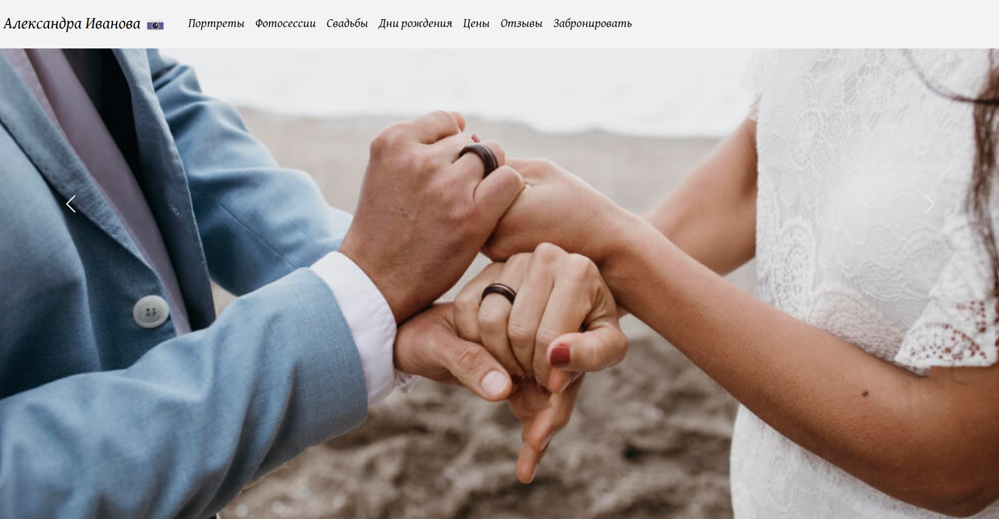

# Photographer website

This is a fully-responsive website of a photographer Alexandra Ivanova made with [Bootstrap](https://getbootstrap.com/) framework.

<a href="https://your-fav-photo.netlify.app/"><strong>➥ Live Demo</strong></a> 

## Description

The project shows a possible variant of a photographer website. You can see a responsive fixed top navbar, a couple of carousels with the photographer's works, a section with provided services, prices section, a banner, testimonials and a footer with contact info.

***The purpose of this project** was to train my skills in **Bootstrap** by using different elements and customizing them according to the necessary design.

Moreover, I also practiced AOS (Animated On Scroll Library) **to animate images and words**.

### Built with

- HTML5
- CSS3
- [Bootstrap](https://getbootstrap.com/)
- [AOS](https://michalsnik.github.io/aos/)

### Screenshots

## License

This project is **free to use** and does not contain any license.
